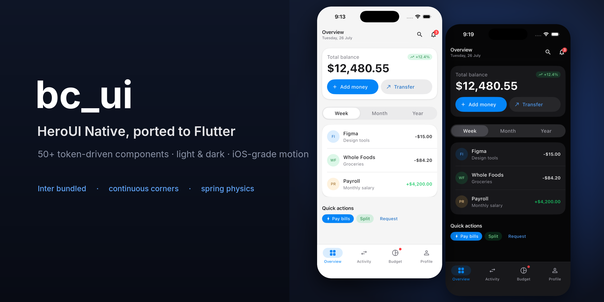
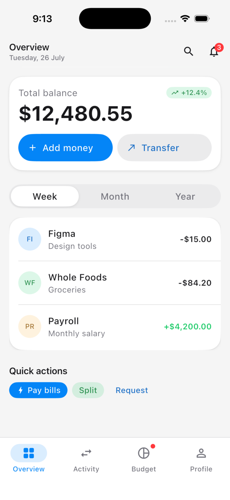
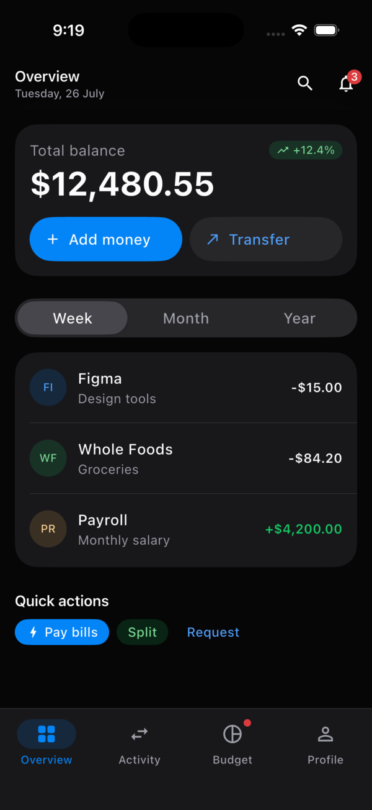

<p align="center">
  
</p>

<p align="center">
  <b>A Flutter design system that ports <a href="https://github.com/heroui-inc/heroui-native">heroui-native</a> 1:1</b><br>
  Same tokens, same variants, same motion — on a Material 3 base, so the rest of the Material ecosystem keeps working.
</p>

<p align="center">
  <a href="doc/api.md"><b>API reference</b></a> ·
  <a href="#components">Components</a> ·
  <a href="#theming">Theming</a> ·
  <a href="#example-app">Example app</a>
</p>

---

## Why

- **One token system, 64 semantic color slots.** Every color is precomputed from
  heroui-native's oklch sources — including each `color-mix` derived hover/soft
  shade — into a light and a dark palette. No component hard-codes a color.
- **iOS-grade surfaces.** Continuous ("squircle") corners via
  `RoundedSuperellipseBorder`, layered surface/overlay shadows, and frosted
  headers built on real `BackdropFilter` blur.
- **The motion is ported, not approximated.** Press scale 0.985 with width
  compensation, switch thumb spring (mass 2 / stiffness 1600 / damping 120),
  tab indicator that tracks your finger, 1500ms shimmer — see `BCMotion`.
- **Material stays available.** `BCTheme.light()` returns a `ThemeData`, so
  `Scaffold`, `Navigator`, `showDialog` and every Material widget still work.
- **Inter is bundled.** No font setup, no missing-glyph surprises.
- **50+ components**, all light/dark aware, all documented in the
  [API reference](doc/api.md).

<table>
  <tr>
    <td align="center"><br><sub><b>Light</b></sub></td>
    <td align="center"><br><sub><b>Dark</b></sub></td>
  </tr>
</table>

<sub>The screen above is assembled entirely from bc_ui — header, card, buttons,
tabs, list group, chips, bottom nav. Its source is
<a href="example/lib/showcase/screens/demo_app_screen.dart"><code>example/lib/showcase/screens/demo_app_screen.dart</code></a>.</sub>

## Install

```yaml
dependencies:
  bc_ui:
    path: ../bc_ui # or a git / hosted reference
```

Requires Dart SDK `^3.12.1`. No other runtime dependencies.

## Setup

```dart
import 'package:bc_ui/bc_ui.dart';

MaterialApp(
  theme: BCTheme.light(),
  darkTheme: BCTheme.dark(),
  themeMode: ThemeMode.system,
  // Only needed if you use BCToast:
  builder: (context, child) => BCToastProvider(child: child!),
  home: const HomeScreen(),
);
```

That's the whole setup — every component reads its colors from the
`BCThemeExtension` those two factories install.

## Quick start

```dart
// Buttons: 7 variants x 3 sizes
BCButton(
  variant: BCButtonVariant.secondary,
  onPressed: () {},
  startContent: const Icon(Icons.add, size: 18),
  child: const Text('Add item'),
);

// A frosted app header — pair with extendBodyBehindAppBar so there is
// something to blur. The hairline appears only once content scrolls under.
Scaffold(
  extendBodyBehindAppBar: true,
  appBar: BCAppHeader(
    title: const Text('Inbox'),
    subtitle: const Text('12 unread'),
    actions: [
      BCHeaderIconButton(icon: const Icon(Icons.search), onPressed: () {}),
    ],
  ),
  body: ListView(children: const []),
);

// Swipeable tabs: the bar and the panels share one controller, so a drag
// switches tabs and carries the indicator with it.
final tabs = BCTabsController<String>(values: const ['music', 'podcasts']);

Column(
  children: [
    BCTabs(items: items, controller: tabs, fullWidth: true),
    Expanded(
      child: BCTabView(
        controller: tabs,
        children: const [MusicPanel(), PodcastsPanel()],
      ),
    ),
  ],
);

// Compound form field with built-in validation states
BCTextField(
  isRequired: true,
  children: [
    const BCTextFieldLabel('Email'),
    const BCTextFieldInput(hintText: 'you@example.com'),
    const BCTextFieldDescription("We'll never share your email."),
  ],
);

// Toast
BCToast.show(context, const BCToastData(
  title: 'Changes saved',
  variant: BCToastVariant.success,
));
```

## Components

Full props, defaults and enums for every entry: **[API reference](doc/api.md)**.

| Category | Components |
|---|---|
| **Navigation** | [`BCAppHeader`](doc/api.md#bcappheader) · [`BCSliverAppHeader`](doc/api.md#bcsliverappheader) · [`BCHeaderIconButton`](doc/api.md#bcheadericonbutton) · [`BCBottomNav`](doc/api.md#bcbottomnav) · [`BCNavRail`](doc/api.md#bcnavrail) · [`BCNavDrawer`](doc/api.md#bcnavdrawer) · [`BCToolbar`](doc/api.md#bctoolbar) · [`BCTabs`](doc/api.md#bctabs) · [`BCTabView`](doc/api.md#bctabview) |
| **Actions** | [`BCButton`](doc/api.md#bcbutton) · [`BCSocialAuthButton`](doc/api.md#bcsocialauthbutton) · [`BCBrandLogo`](doc/api.md#bcbrandlogo) · [`BCLinkButton`](doc/api.md#bclinkbutton) · [`BCCloseButton`](doc/api.md#bcclosebutton) · [`BCFab`](doc/api.md#bcfab) · [`BCSpeedDial`](doc/api.md#bcspeeddial) · [`BCToggleButton`](doc/api.md#bctogglebutton) · [`BCToggleButtonGroup`](doc/api.md#bctogglebuttongroup) · [`BCPressable`](doc/api.md#bcpressable) |
| **Containers** | [`BCSurface`](doc/api.md#bcsurface) · [`BCCard`](doc/api.md#bccard) · [`BCListGroup`](doc/api.md#bclistgroup) · [`BCFlipCard`](doc/api.md#bcflipcard) · [`BCScrollShadow`](doc/api.md#bcscrollshadow) |
| **Data display** | [`BCText`](doc/api.md#bctext) · [`BCAvatar`](doc/api.md#bcavatar) · [`BCChip`](doc/api.md#bcchip) · [`BCTagGroup`](doc/api.md#bctaggroup) · [`BCSeparator`](doc/api.md#bcseparator) · [`BCSkeleton`](doc/api.md#bcskeleton) · [`BCSpinner`](doc/api.md#bcspinner) · [`BCProgress`](doc/api.md#bcprogress) · [`BCLoadingOverlay`](doc/api.md#bcloadingoverlay) · [`BCRating`](doc/api.md#bcrating) · [`BCEmptyState`](doc/api.md#bcemptystate) |
| **Forms** | [`BCInput`](doc/api.md#bcinput) · [`BCTextField`](doc/api.md#bctextfield) · [`BCTextArea`](doc/api.md#bctextarea) · [`BCPasswordInput`](doc/api.md#bcpasswordinput) · [`BCSearchField`](doc/api.md#bcsearchfield) · [`BCInputOTP`](doc/api.md#bcinputotp) · [`BCDateField`](doc/api.md#bcdatefield) · [`BCTimeField`](doc/api.md#bctimefield) · [`BCDateTimePicker`](doc/api.md#bcdatetimepicker) · [`BCSelect`](doc/api.md#bcselect) · [`BCControlField`](doc/api.md#bccontrolfield) |
| **Selection** | [`BCCheckbox`](doc/api.md#bccheckbox) · [`BCRadioGroup`](doc/api.md#bcradiogroup) · [`BCSwitch`](doc/api.md#bcswitch) · [`BCSlider`](doc/api.md#bcslider) · [`BCRangeSlider`](doc/api.md#bcrangeslider) |
| **Overlays** | [`BCDialog`](doc/api.md#bcdialog) · [`BCPopover`](doc/api.md#bcpopover) · [`BCMenu`](doc/api.md#bcmenu) · [`BCToast`](doc/api.md#bctoast) |

The three pickers — `BCDateField`, `BCTimeField`, `BCDateTimePicker` — share a
`presentation` prop (`dialog`, `popover`, `bottomSheet`), so swapping one for
another never changes how it opens.

Naming is predictable across the library: `variant` picks the look, `size`
picks the metrics, state is controlled (`value` + `onValueChange`), and
disabled/invalid are always `isDisabled` / `isInvalid`.

## Theming

### Custom accent

```dart
BCTheme.light(
  overrides: BCThemeOverrides(accent: const Color(0xFF0F766E)),
);
```

Accent-derived tokens (hover, soft, soft-foreground, focus) are recomputed for
you, so a single color change stays consistent everywhere.

### Reading tokens in your own widgets

```dart
final bc = context.bcTheme;

DecoratedBox(
  decoration: ShapeDecoration(
    color: bc.accentSoft,
    shape: BCShapes.continuous(BCRadius.xxl),
    shadows: bc.surfaceShadow.shadows,
  ),
);
```

### Design tokens

`BCColorsLight`/`BCColorsDark` (raw palettes) · `BCRadius` (2→32, `field` 14) ·
`BCSpacing` (4px unit) · `BCTypography` (tailwind text scale) · `BCShadows`
(layered surface/overlay shadows) · `BCMotion` (springs and timings) ·
`BCShapes` (continuous corners) · `BCSizes` · `BCDuration` · `BCBreakpoints`.

See [Theme and tokens](doc/api.md#theme-and-tokens) for the full list.

## Example app

`example/` mirrors heroui-native's demo: a full demo screen plus one page per
component, each with vertically paged usage variants and a pagination rail.

```bash
cd example && flutter run
```

## Documentation

- **[API reference](doc/api.md)** — every component, prop, default and enum.
  The prop tables are generated from the source, so they track the code.
- `dart doc` generates the full dartdoc site from the inline documentation.

## Tests

```bash
flutter test
```

## License

The `LICENSE` file is still a placeholder — pick a license before publishing.
